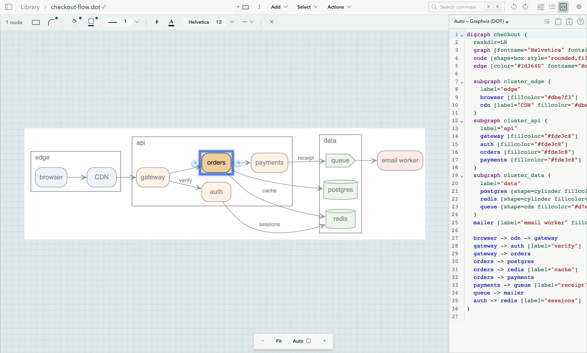

# Graph Explorer

Explore and edit Graphviz (DOT) and Mermaid diagrams.

- **Website:** <https://graph-explorer.net>
- **Web app:** <https://graph-explorer.net/app>
- **Downloads:** [latest release](https://github.com/jpablo/graph-explorer/releases/latest)



Graph Explorer shows DOT and Mermaid text as a diagram that you can work on.
Select a node to change its style. Hide the parts that you do not need. Drag
from a node to add an arrow. Each edit also changes the source text.

Graph Explorer has three parts:

- **The desktop app** for macOS, Windows, and Linux. It follows your diagram
  files: when a file changes on disk, the diagram changes on the screen.
- **`gx`**, a command-line tool. It reads and edits diagram files, and it tells
  the desktop app what to show. Coding agents can use it.
- **The web app** at <https://graph-explorer.net/app>. It needs no install.

## Features

- **Large graphs.** Show or hide the nodes before or after the selection, one
  layer at a time or all of them. Collapse a group into one node, or zoom into
  it. Press `/` to find a node and `⌘K` to find a command.
- **Edit the diagram.** Change the shape, fill, border, and font from the
  toolbar. Drag from a node to add an arrow. Drag the end of an arrow to connect
  it to a different node. Edit DOT records and HTML tables one cell at a time.
- **Graphviz layout.** The `dot` layout engine is a port of Graphviz 13.0.1 to
  Scala (see [`graphviz/`](graphviz/README.md)). For the same input, it makes
  the same SVG as Graphviz, byte for byte. The other engines (neato, fdp, sfdp,
  twopi, circo, osage, patchwork) come from Viz.js.
- **Mermaid.** All the diagram types of Mermaid 11 show and change while you
  type. In a flowchart, you can also select, hide, and edit the nodes.
- **Copy and share.** Copy the diagram or the selection as SVG, or copy the
  graph as DOT or JSON. In the web app, copy a link that holds the full diagram.
- **Themes.** Ten themes, and an experimental 3D view.

## Desktop app

Download the file for your platform from the
[latest release](https://github.com/jpablo/graph-explorer/releases/latest).

| Platform | File | Notes |
|---|---|---|
| macOS (Apple silicon) | `graph-explorer-desktop-vX.Y.Z-macos.dmg` | Signed and notarized. There is no build for Intel Macs. |
| Windows (x64) | `graph-explorer-desktop-vX.Y.Z-windows.exe` | The file is the app. It is not signed, so SmartScreen can show a warning. |
| Linux (x86-64) | `graph-explorer-desktop-vX.Y.Z-linux` | The file is the app. Run `chmod +x` on it. It needs WebKitGTK 4.1 (`libwebkit2gtk-4.1-0` on Debian and Ubuntu). |

The desktop app does not update itself. Download each new release.

What the desktop app adds to the web app:

- **Open a file from disk.** Run `gx open diagram.dot`. The app has no file
  picker, so open files with `gx`.
- **Live reload.** The app watches the files that it shows. After a save in
  your editor, the diagram shows the change.
- **Save back.** Press `⌘S` (`Ctrl+S` on Windows and Linux) to write your edits
  to the file. If the file changed on disk, the app asks which version to keep.
- **A library on disk.** Library diagrams are files in
  `~/.graph-explorer/library`. The app and `gx` share them. Set `GX_HOME` to use
  a different folder.

## gx

`gx` is a separate file in each release: `gx-vX.Y.Z-macos`, `gx-vX.Y.Z-linux`,
or `gx-vX.Y.Z-windows.exe`. Put it in a folder on your `PATH` and make it
executable. On macOS, the first run needs an internet connection, because macOS
checks the notarization.

```bash
gx status                        # the library folder, and if the desktop app runs
gx run arch.dot list-nodes       # the nodes of a file
gx run arch.dot set-attribute \
  --params '{"targets":["node:db"],"name":"shape","value":"cylinder"}'
gx import arch.dot               # add the file to the library, linked to it
gx open arch.dot                 # show the file in the desktop app
```

Only `gx open` and `gx session` need the desktop app. All other commands work
with no window. Run `gx help` for the full list.

**Coding agents.** [`skills/gx`](skills/gx/SKILL.md) is a skill that tells a
coding agent how to use `gx`. Run `gx skill` to get its address for your
version of `gx`.

## Web app

The web app is at <https://graph-explorer.net/app>. It keeps your diagrams in
the storage of your browser, so they are only on that browser.

The web app can open a diagram from a link:

- The form is `https://graph-explorer.net/diagrams/<id>?dot=<text>`, where
  `<text>` is DOT or Mermaid text, encoded with `encodeURIComponent`.
- If a diagram in your library has the same id or the same text, that diagram
  opens. If not, the app makes a new diagram from the text.
- To make a link, press `⌘K` and run the command "Share URL".
- A very large diagram makes a very long link.

## Build from source

You need [sbt](https://www.scala-sbt.org/) and [Node.js](https://nodejs.org/).

```bash
git clone https://github.com/jpablo/graph-explorer.git
cd graph-explorer
npm install
```

Run the web app with hot reload. Use two terminals:

```bash
sbt "~viewer/fastLinkJS"
```

```bash
npm run dev
```

Then open <http://localhost:5173/app>. The product page is at
<http://localhost:5173/site/>.

Run all the tests:

```bash
sbt testFull
```

Under sbt 2, `sbt test` runs only the tests that failed before or whose code
changed. `sbt testFull` runs all of them.

Make a production build of the web app and the product page (output in `dist/`):

```bash
sbt viewer/fullLinkJS && npm run build
```

Build the desktop app. It needs Rust and the Tauri CLI
(`cargo install tauri-cli --version "^2"`), and it puts `dist/` into the app, so
make the production build first:

```bash
cd desktop/src-tauri && cargo tauri build
```

Build `gx`. It needs sbt and [scala-cli](https://scala-cli.virtuslab.org/),
which gets GraalVM:

```bash
scripts/build-gx.sh
```

[Development.md](Development.md) tells how to make a release.

## Repository layout

| Folder | Contents |
|---|---|
| [`shared/`](shared) | The graph model, the DOT parser, and the Mermaid scan. Compiled for the JVM and for JavaScript. |
| [`graphviz/`](graphviz/README.md) | The port of the Graphviz `dot` layout engine. |
| [`viewer/`](viewer) | The app itself, in Scala.js and Laminar. The web app and the desktop app use it. |
| [`desktop/`](desktop) | The desktop app (Tauri). |
| [`gx-core/`](gx-core), [`gx-cli/`](gx-cli) | The `gx` tool. |
| [`skills/gx/`](skills/gx/SKILL.md) | The skill for coding agents. |
| [`site/`](site) | The product page at <https://graph-explorer.net>. |
| [`docs/`](docs) | Design notes. |

## Hosting

Netlify builds the site with
[`scripts/build-viewer-netlify.sh`](scripts/build-viewer-netlify.sh).
[`_redirects`](viewer/src/main/resources/_redirects) sends `/` to the product
page (`site/index.html`) and all other paths to the web app (`index.html`). The
web app shows its library at `/app`.

## License

[Apache License 2.0](LICENSE)

Copyright 2025 Juan Pablo Romero and the graph-explorer contributors.
