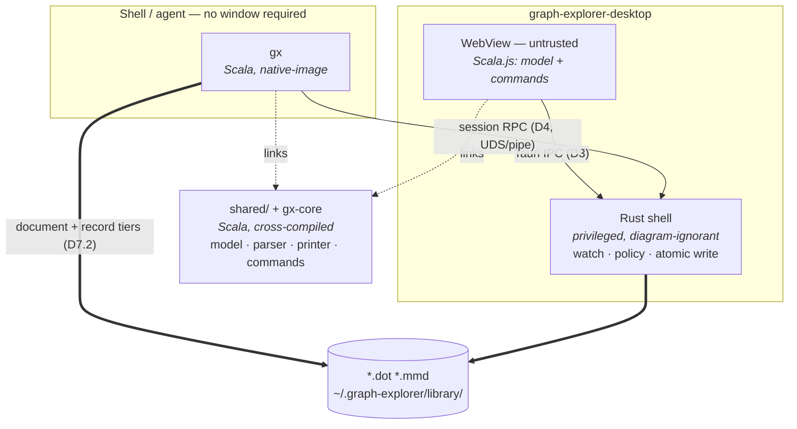

# Desktop + `gx` v2 Architecture

Status: Proposed (2026-08-16)
Supersedes: `local-capabilities-v1-architecture.md` (v1 remains the description of
what shipped)
Reads with: `desktop-redesign-brief.md` (what v1 actually does), and
`sources-and-library-architecture.md` (the domain model — what a diagram is)

D2's performance claims are measured, not estimated; the spike is described
inline at D2.1.

v1 works. This document is not about stabilizing it — it is about deciding what
it is for, and then drawing the boundaries so the answer holds.

---

## 1. What v2 is for

**Files are the substrate. `gx` and the desktop are two peers over them.**

v1 made the desktop the file authority and `gx` a client of it. The consequence
is stated plainly in the brief §6: `gx` requires a running GUI, which makes it
unusable in exactly the headless and agent contexts it was built for.

v2 inverts that. The authority is a Scala library (D2) that `gx` and the viewer
both link. `gx` reads, writes, watches, parses, and mutates on its own. The
desktop does the same, and additionally draws pictures. Neither is a client of
the other for file operations; they talk only about the live *session* (D7.2).

Two properties follow, and they are the point of the redesign:

- `gx` works with no desktop running — every command, not just `status`
- the desktop is the only thing that needs a GUI, so the credential that guards
  a GUI's webview never has to guard the filesystem

---

## 2. Who is protected from whom

v1's security model is inherited rather than argued. Argue it.

Three principals reach the control API:

| Principal | Privilege it already has | What v1 does |
|---|---|---|
| `gx` | Runs as the user. Can `open()` any file directly, desktop or not. Already calls `fs::canonicalize` (`gx/src/main.rs:241`) | Enforces allow/deny policy on its requests |
| Other same-user processes | `control.json` is mode 0600 — that stops other *users*, not other processes of this user. Any of them can read the token | Same policy enforcement |
| The webview | Renders content the user did not write: a `.dot`/`.mmd` from anywhere, Mermaid HTML labels, an imported project | Handed the full token, on every event, with `Access-Control-Allow-Origin: *` |

The first two are already equivalent to *being the user*; policy checks on them
are advisory — the caller asked politely and could have not asked. The third is
the only principal that is not the user, and it is the one holding the
credential.

**Decision: the webview is an untrusted principal.**

Everything in §3 follows from that sentence.

Note what this decision does *not* claim. It does not claim policy is useless:
an allow/deny list is a guardrail against a mistyped path or a runaway agent,
and an audit log is worth keeping. It claims only that policy is not a security
boundary against a principal that could bypass it, and should stop being
designed as if it were.

---

## 3. Decisions

Each of these answers a question the brief or v1 §15 left open. Where a choice
is genuinely arguable, the alternative is named.

### D1 — Revision is derived from content, not counted in memory

`revision: u64` becomes `revision: ContentHash` — a stable hash (BLAKE3) of the
file's bytes on disk.

- any process computes it independently; no registry consultation
- it survives crashes and restarts; no "revisions restart at 1"
- `baseRevision` becomes compare-and-swap: *write T to P only if P currently
  hashes to H*. This is `If-Match` semantics
- `get` no longer requires a prior `watch` — reading a file is just reading a
  file

This single change retires four brief §3 rows: in-memory-only watches, crash
recovery, `DefaultHasher` instability, and the watch-registry-as-document-store
coupling.

*Alternative considered:* keep monotonic counters, persist them to
`~/.graph-explorer/runtime/`. Rejected — it reintroduces a coordination point
between two processes to recover a property (monotonicity) nothing needs.
Conflict detection needs *identity*, not *order*.

*Cost, stated honestly:* two writes that produce identical content are
indistinguishable, and an A→B→A sequence returns to the original revision. For
conflict detection on a text file this is correct behavior, not a defect: if the
content I based my edit on is what is there now, my edit is safe.

### D2 — `gx` is Scala, compiled with GraalVM native-image

**`gx` is rewritten in Scala and links `shared/` directly.** The Rust `gx`
(584 lines of thin HTTP client) is retired.

The reason is not code reuse in the abstract. It is that `gx`'s roadmap requires
understanding diagrams:

- **surgical text edits** (`sources-and-library-architecture.md` §5.3) need the
  DOT/Mermaid parser to know where a subgraph closes
- **queries** ("list the nodes") need `ViewerGraph`
- **format detection** already exists in `shared/` and nowhere else

In Rust each of those is a reimplementation of a parser and graph model that
already exist, tested, in `shared/` — precisely the duplication this codebase's
Graphviz-port discipline exists to prevent.

`shared` is already `crossProject(JSPlatform, JVMPlatform)` with
`CrossType.Pure` (`build.sbt:30`), depending only on `graphviz` (also
platform-free) and pure-Scala libraries. **A JVM `gx` requires no new
cross-compilation work.**

#### D2.1 — native-image is required, not an optimization

Measured on macOS/ARM, driving the real production parse path:

| Binary | 6-node | 500-edge | Size |
|---|---|---|---|
| Rust `gx status` *(no diagram work at all)* | 4.3 ms | — | 3.4 MB |
| **Scala native-image — parse only** | **7.2 ms** | **8.5 ms** | 14 MB |
| Scala native-image — parse + layout | 10.6 ms | 90.8 ms | 25 MB |
| Scala JVM jar | 512 ms | — | 13 MB |

Findings:

- **The startup objection is dead.** ~3ms over a Rust binary that parses
  nothing. Parse cost is nearly flat from 6 nodes to 500 edges — it is almost
  all process start, so queries stay under 10ms at any graph size.
- **The JVM path is disqualified** at 512ms/invocation. native-image is a
  standing build requirement, not a tuning option.
- **native-image needed zero configuration.** 27s build, no reflection config,
  byte-identical output. fastparse and upickle are derivation-based, so the
  usual native-image reflection misery does not arise.
- **The 91ms figure is layout, not language.** `dot_json` runs a full `dot`
  layout; Rust would run the same algorithm and has no port of it. Hence D2.3.

Unverified, and the remaining risk: Linux and Windows native-image builds; peak
build RSS was **5.53 GB** against a 7 GB standard GitHub runner; and `java.nio`
file I/O under native-image. **De-risk with a Linux + Windows CI build before
writing `gx-core`.** `gx` also inherits the project's `-experimental` flag
(`experimental.pureFunctions`).

#### D2.2 — `gx-core` is a Scala module

```
gx-core/            (Scala, JVM+JS cross-compiled, depends on shared)
  policy      allow/deny roots, canonicalization, symlink rules (D6)
  document    read, compare-and-swap write, atomic + fsync
  watch       change detection, debounce, self-write suppression
  store       library records, folder tree
  command     the command/query vocabulary (D7)
  audit       structured JSONL events
```

Brief §1 notes the LC-INV-01..10 matrix is exercised only as a side effect of
shell smoke scripts, never asserted by name. Invariants over a library are
ordinary MUnit tests, run under `sbt testFull` with everything else.

#### D2.3 — Queries and mutations must not take the layout path

`Graphviz.renderFormats(text, Seq("dot_json"))` runs a full `dot` layout: 91ms
on a 500-edge graph against 8.5ms for parsing alone. Layout is needed to
*render*, never to answer "what nodes exist" or to insert an edge. Command and
query implementations use the parser directly.

#### D2.4 — Rust does not disappear, it gets dumber

The desktop is Tauri, so Rust remains — but only for what needs privilege and no
diagram knowledge. See §3.5.

### D2.5 — Separate privilege from intelligence

The organizing principle the language decision produces:

| Component | Language | Privilege | Diagram knowledge |
|---|---|---|---|
| desktop shell | Rust / Tauri | full | **none** |
| viewer | Scala.js | **none** | full |
| `gx` | Scala / native-image | full | full |

The Rust side stays deliberately ignorant. Watching bytes, checking a path
against a policy, and renaming a temp file over a target require no
understanding of diagrams — so there is nothing in the Rust side to duplicate,
and it cannot drift from `shared/` because it never models the same things.

The webview keeps model knowledge with no capability, which is D3 — now with a
*reason* rather than a restriction.

`gx` holds both, which §2 already established is honest: it runs as the user and
could do anything the user can, with or without our permission.

### D3 — The webview gets IPC, never a credential

UI → native goes through Tauri commands:

```rust
#[tauri::command] fn open_document(path: String) -> Result<Document>
#[tauri::command] fn save_document(path: String, text: String, base: ContentHash)
                     -> Result<Document, SaveError>
#[tauri::command] fn list_documents() -> Vec<DocumentRef>
```

Native → UI keeps an event channel, but the payload loses `port` and `token`.

Consequences:
- no credential in the JS heap or in DOM event payloads
- no cross-origin `fetch` from the page, so `Access-Control-Allow-Origin: *`
  goes away with the thing that required it
- `DesktopBridgeContext` in `Viewer.scala` loses its `port`/`token` fields and
  becomes a pure document reference

Tauri commands are still reachable from page JS — IPC is not a sandbox. What it
buys is that the capability is *enumerated and revocable* (three named commands,
subject to policy, audited) rather than *ambient* (a bearer token for a general
HTTP API). Reducing an untrusted principal from "the whole API" to "three
audited verbs" is the achievable win; claiming the webview is now isolated would
be overselling it.

### D4 — The control channel is a unix socket / named pipe, carrying RPC

Transport: `~/.graph-explorer/runtime/control.sock` (Unix), named pipe
(Windows). Authentication is filesystem/pipe permissions — OS peer credentials
instead of a bearer token.

- **the token disappears from the design entirely**
- a webview cannot `fetch()` a unix socket, so the transport *enforces* D3
  rather than relying on the page to behave
- brief §4's URL-percent-decoding hazard cannot recur: there are no URLs

**An earlier draft of this decision had the channel carry display intents only
(`show`, `showing`), and briefly proposed deleting it in favour of watched
files.** That was wrong, for one reason: **queries need answers.** "Give me the
list of nodes in the open diagram" is not expressible as watched state at any
level of cleverness. The channel is request/response RPC, and its surface is
D7's session tier.

*Alternative considered:* keep loopback HTTP for debuggability (`curl` works,
which is genuinely valuable). Rejected because a port any local process can
connect to is what forces a token to exist at all. `gx` gains a
`--debug-protocol` flag to dump frames instead.

*If this decision is reversed* and HTTP stays, D3 becomes mandatory and
load-bearing on its own, and the token must never enter the page.

### D5 — `gx` commands split along "does this need a screen?"

| Command | Needs desktop | Behavior when absent |
|---|---|---|
| `gx get <path>` | no | works |
| `gx set <path>` | no | works |
| `gx watch <path>` | no | streams changes to stdout |
| `gx status` | no | reports "no desktop" without failing |
| `gx open <path>` | yes | clear message, exit 2 — or launch it (D8) |
| `gx watch --open` | for the `--open` part | watches regardless; warns that nothing is displaying |

`gx watch` with no desktop becomes a genuinely useful primitive: a change stream
on stdout that a script or agent can pipe. That is the headless story v1 lacked.

Exit codes carry over from v1 §10 unchanged, except that `2` now means "you
asked for something that needs a window" rather than "nothing works".

### D6 — Policy defaults, stated rather than defaulted

Brief §5 is correct that v1's allow-all was answered by omission. Answer it:

- **allow-all stays the default**, and is now a decision with a reason: the
  principals that policy binds are already equivalent to the user (§2), so a
  strict default buys friction rather than security
- policy is documented as **a guardrail, not a boundary** — it catches mistakes
  and runaway agents, not adversaries
- the denylist stays on by default and is the part that earns its keep
- **symlinks: resolve before every policy check, then apply policy to the
  resolved path.** This is what `fs::canonicalize` incidentally does today
  (brief §3, last row); v2 specifies it and tests it
- **no prompt path.** v1 §9.2's "unless user confirms" is removed from the
  design rather than left as an unbuilt promise

### D7 — Commands and queries: one vocabulary, three tiers

**This decision was previously answered "desktop-hosted only". That answer was
an artifact of Rust**, not a design finding: commands need the model, the model
is Scala, Rust could not host it, therefore commands needed the webview. D2
removes the premise, so the question is re-answered here.

#### D7.1 — One vocabulary, several hosts

The command set is defined once, in `gx-core/command`, over `shared/`. It has
three callers, not two implementations:

1. the UI's own menus, toolbars and gestures
2. socket clients — `gx`, agents, LLMs
3. later: scripting and macros

The UI must not keep calling `Ops` functions directly while RPC goes through a
parallel path. Undo/redo, the audit log, and replay all fall out of a named,
serializable command set, and none of them are cheap to retrofit.

Six pure `Ops` modules already exist in `shared/` (`AttributesOps`,
`CollapseOps`, `CombineNodesOps`, `GroupsOps`, `TraversalOps`,
`VisibilityRules`). They are the vocabulary already; what they lack is
*addressability* — names, serializable argument forms, stable element references
over the wire.

#### D7.2 — Three tiers, split by what the operation is *about*

| Tier | Operates on | Examples | Headless? |
|---|---|---|---|
| **Document** | the diagram text | `add-arrow`, `set-attribute`, `rename-node`, `list-nodes` | **Yes** — `gx` parses and writes |
| **Record** | stored metadata | `hide`, `collapse`, `tag`, `move-to-folder`, `rename-diagram` | **Yes** — `gx` writes the store record |
| **Session** | the live view | `show`, `focus`, `select`, `zoom-to-fit`, `what-is-selected` | **No** — RPC to a running desktop |

This is the same line `sources-and-library-architecture.md` §5.3.1 draws between
text and metadata, extended one step: **Document and Record are *state*; Session
is *view*.** The first two are headless because state is on disk and `gx` can
read and write it. The third needs a window because there is no live view
without one — a limit of the concept, not of the implementation.

#### D7.3 — Headless commands still reach a running UI

A `gx` document or record command writes the file or the store record. The
desktop's watcher observes it and updates. **So headless mutation and live
update are the same path** — no RPC involved, and the LLM flow works whether or
not a window happens to be open.

Consequence: the store is the live state. UI edits are debounced into the record
continuously (as `localStorage` already is today, per keystroke), so `gx` reading
the store sees current state and "unsaved UI state" does not exist as a category.

#### D7.4 — RPC is also a fast path, later

Mutating through the file costs a write plus a poll interval plus a re-parse per
command. For an agent issuing many mutations against a live session, RPC to the
desktop avoids that amplification. This is an **optimization, deliberately
deferred** — the correctness path is D7.3, and the fast path must produce
identical results or it is a bug.

### D8 — Deferred, explicitly

Named so they are not silently dropped:

- **`gx` launching the desktop** (v1 §6.1). Wanted; not v2-blocking
- **Unsaved UI drafts persisted separately** (v1 §15). Deferred; v2 keeps
  explicit-save-only
- **One-writer-per-file** (v1 §15). Rejected for now — D1's compare-and-swap
  makes last-write-wins-with-detection safe enough, and a lock is a new failure
  mode
- **Workspaces / reopen-what-you-had** (brief §5). Real gap, wants its own design
- **Headless rendering (`gx render`)**. The layout engine is Scala; making `gx`
  render means embedding a JS runtime or a JVM. Out of scope, worth its own
  decision later

---

## 4. Architecture



Read the diagram for what is *absent*: no arrow from the webview to a network
port, no credential on any edge, and `gx`'s path to the files does not pass
through the desktop.

Read it also for the one thing that **is** duplicated. `shared/ + gx-core` is
linked by `gx` and the viewer, but the Rust shell reimplements the file
primitives — watch, policy, atomic write — perhaps 200 lines. That is accepted
because those primitives model no diagram concepts and so cannot drift
semantically. What *can* drift is the **contract**: canonicalization rules and
the hash algorithm are the join key for the whole library. Both must be
specified once and **cross-tested in both languages against shared fixtures**,
not merely written twice. See §8.5 for the alternative that removes the
duplication.

---

## 5. Invariants

Brief §1: the v1 test matrix was never asserted by name. These are stated so
they can be, as `gx-core` unit tests unless marked otherwise.

| # | Invariant |
|---|---|
| V-01 | A write with a stale base hash is rejected, and the file on disk is unmodified |
| V-02 | A write that succeeds is atomic: a concurrent reader sees old or new bytes, never partial |
| V-03 | A write preserves the target's existing permission bits (fixes `main.rs:1076`) |
| V-04 | A write preserves the file's dominant line ending |
| V-05 | A self-write never produces a change notification |
| V-06 | A deleted watched file produces an actionable event, not silence |
| V-07 | Policy is evaluated on the fully resolved path; a symlink out of an allowed root is denied |
| V-08 | Every allow, deny, write, and conflict appears in the audit log |
| V-09 | Every non-display `gx` command succeeds with no desktop running (integration) |
| V-10 | Disk → UI median stays under 300ms (existing smoke harness, unchanged) |
| V-11 | The webview holds no credential: no token in any IPC payload or event (integration) |
| V-12 | A save whose UI window is gone reports its true outcome (fixes `main.rs:1038`) |
| V-13 | Scala and Rust agree on canonicalization and content hash for a shared fixture set — spaces, non-ASCII, symlinks, case variants, Windows UNC (cross-language, the §4 contract) |
| V-14 | `gx` cold start stays under 20ms for a parse-only command, at any graph size (regression gate on D2.1) |
| V-15 | A document or record command issued by `gx` with no desktop running succeeds, and is reflected in the UI when a desktop is later started (D7.3) |

---

## 6. Phasing

Each phase is independently shippable and leaves the tree green.

**P0 — De-risk native-image across platforms.** Build the spike on Linux and
Windows in CI; confirm build RSS fits the runners; exercise `java.nio` file I/O
under native-image. **Blocking gate for D2** — everything below assumes it
passes. If it fails, the fallback is a `gx serve` daemon with a thin client,
which D7.4 wants eventually anyway.

**P1 — `gx-core` in Scala.** New cross-compiled module depending on `shared`.
Policy, document, watch, store, audit. Land V-01..V-08 as MUnit tests —
including the three that currently fail (V-03, V-04, V-06). No behavior change
to the shipped desktop yet.

**P2 — Content-addressed revisions (D1).** BLAKE3 in place of the counter.
Removes the watch-registry-as-store coupling; `gx get` works on unwatched paths.
Cross-test the hash and canonicalization contract against the Rust side (§4).

**P3 — `gx` rewritten in Scala (D2, D5).** File commands go through `gx-core`
directly; `gx watch` gains a stdout change stream. Retire the Rust `gx`. V-09,
V-13, V-14.

**P4 — IPC bridge, token removed from the page (D3).** Tauri commands; strip
`port`/`token` from event payloads; update `Viewer.scala`. V-11, V-12.

**P5 — Socket replaces HTTP (D4).** UDS/named pipe. Delete the token, the CORS
headers, and the HTTP server. Retire `local-protocol/v1/schema.json`, including
the SSE endpoint it advertises and nothing implements.

**P6 — Command vocabulary (D7).** Name and serialize the command set over the
existing `shared/` ops; route the UI through it; expose document and record
tiers via `gx`; expose the session tier over the socket.

P1–P3 deliver the headless story. P4–P5 deliver the security story. P6 opens the
RPC work. If everything stops after P3, `gx` is already fixed and nothing is
worse than today.

---

## 7. Carried forward from v1 without change

Load-bearing (brief §4). Preserve or re-justify — do not quietly drop:

- **Self-write suppression is by content hash**, not path or mtime. It is what
  prevents write → watch → push → write. D1 makes the same hash serve both jobs
- **The 15ms poll / 50ms debounce** exists to hold the 300ms budget on
  oversubscribed CI runners. Moving to FS events is fine; keep V-10 measurable
  via `scripts/local-capabilities-disk-to-ui-smoke.sh`
- **`--features tauri/custom-protocol`** or the window silently loads `devUrl`
  and shows nothing
- **The build cannot run inside sbt** — vite shells back into sbt to resolve
  `scalajs:` imports and deadlocks against its own nested client
- **Both crates are still `0.1.0`** while shipping in `v0.6.x` releases
  (brief §5). Fix during P1

---

## 8. Open questions

Genuinely undecided, listed so they are not mistaken for settled:

1. **Does the display channel need to be bidirectional?** §4 has the desktop
   reporting what it shows. If nothing consumes that, `show` alone is enough and
   the channel becomes fire-and-forget.
2. **Should `gx watch` be the agent-facing primitive, or is a `gx serve`
   long-lived mode the real want?** D5 assumes the former; no evidence yet.
3. **What happens when `gx` and the desktop watch the same file and both
   write?** D1 makes it safe (one gets a conflict) but not *pleasant*. Whether
   that needs UX or just an error is unknown until it is used.
4. **Is the audit log read by anyone?** If not, it is cost without benefit and
   should either grow a reader (`gx audit`) or be cut.
5. **Should the desktop delegate file work to a `gx` child process** instead of
   reimplementing the file primitives in Rust (§4)? It would remove the
   duplication entirely and leave the Rust shell as nothing but a window. Cost:
   the desktop gains a runtime dependency on the `gx` binary, and the trust
   story gets a second privileged process to explain. Not blocking — the
   duplication is small and V-13 contains the risk — but worth revisiting if the
   Rust file layer grows.
6. **Does `gx` still need Rust's `graphviz` for anything?** The layout port is
   Scala and now available to `gx` directly, which makes `gx render` (deferred
   in D8) substantially cheaper than when it was written down.
