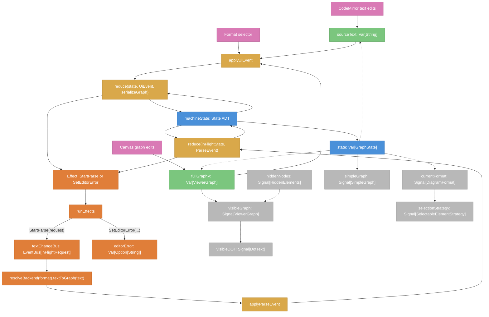
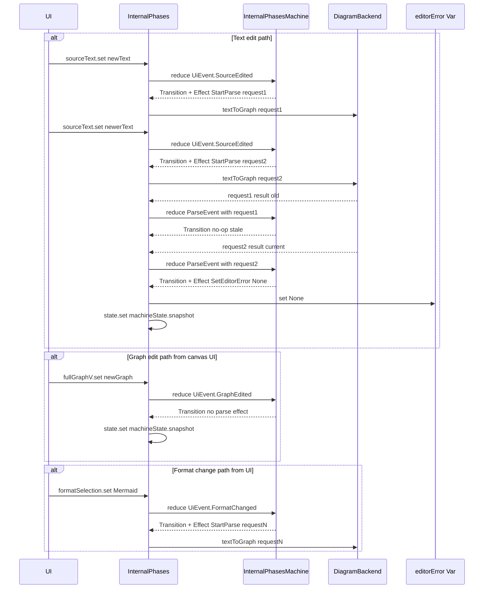

# InternalPhases Data Flow

## Interaction Diagram

## Legend

| Color | Meaning |
|-------|---------|
| Blue | Core state (`machineState`, `state`) |
| Green | Public write/read Vars (`sourceText`, `fullGraphV`) |
| Gold | Reducer and event application |
| Orange | Effect execution and async parse pipeline |
| Gray | Derived signals |
| Pink | External inputs/signals |

## Write Paths

1. **Text edit**: `sourceText.set(newText)` emits `UiEvent.SourceEdited`, reducer updates snapshot, emits `StartParse`, and parser completion is reduced as `ParseSucceeded` or `ParseFailed`.
2. **Format change**: `formatSelection` emits `UiEvent.FormatChanged`, reducer emits `StartParse` for current text in new format.
3. **Graph edit**: `fullGraphV.set(newGraph)` emits `UiEvent.GraphEdited`, reducer serializes graph to text and updates snapshot synchronously.
4. **Editor errors**: only set through `Effect.SetEditorError(...)` in `runEffects`.

## Read Paths

- `sourceText` reads `state.text` (which mirrors `machineState.snapshot.text`)
- `fullGraphV` reads `state.viewerGraph`
- `simpleGraph` derives from `state.text` via `graphviz.textToSimpleGraph`
- `visibleGraph` combines `fullGraphV` with `hiddenNodes`
- `visibleDOT` serializes `visibleGraph` for rendering
- `currentFormat` and `selectionStrategy` derive from `state.format`
