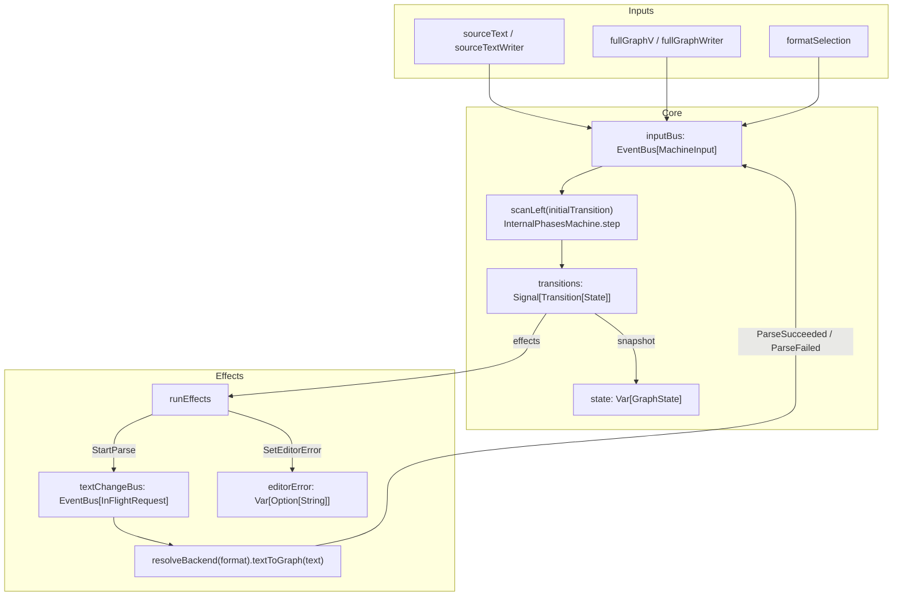

# InternalPhases Data Flow

## Current Architecture (2026-02-19)

`InternalPhases` is now driven by a single machine-input event fold:

- all writes enter through `MachineInput` events (`Ui` or `Parse`)
- `inputBus.events.scanLeft(initialTransition)` computes transitions
- `transitions.changes` is the only effect interpreter boundary
- async parse completions are fed back into the same `inputBus` as `MachineInput.Parse`

## Write Paths

1. Text write (`sourceText.set` or `sourceTextWriter.onNext`)
- emits `MachineInput.Ui(SourceEdited)` to `inputBus`
- fold applies `InternalPhasesMachine.step`
- emitted `StartParse` is interpreted by `runEffects`
- parse completion is mapped to `MachineInput.Parse(...)` and fed back to `inputBus`

2. Graph write (`fullGraphV.set` or `fullGraphWriter.onNext`)
- emits `MachineInput.Ui(GraphEdited)`
- fold updates snapshot synchronously (no parse effect expected)

3. Format change (`formatSelection`)
- emits `MachineInput.Ui(FormatChanged)`
- fold emits `StartParse` for current text in selected format

## Read Paths

- `sourceTextS`: `state.signal.map(_.text).distinct`
- `fullGraphS`: `state.signal.map(_.viewerGraph).distinct`
- compatibility vars:
  - `sourceText` reads/writes through `state` + `sourceTextWriter`
  - `fullGraphV` reads/writes through `state` + `fullGraphWriter`
- derived projections (`visibleGraph`, `visibleDOT`, `currentFormat`, `selectionStrategy`) still depend on `state`

## Key Invariants

1. Transition evaluation happens only in the fold (`scanLeft`), not in write adapters.
2. Effects are executed only from `transitions.changes.foreach(runEffects)`.
3. Parse feedback always re-enters through `MachineInput.Parse`.
4. Snapshot (`state`) remains the sole source for exposed read projections.

## Code Pointers

- event fold: `viewer/src/main/scala/org/jpablo/graphexplorer/viewer/state/InternalPhases.scala:69`
- dispatch ingress: `viewer/src/main/scala/org/jpablo/graphexplorer/viewer/state/InternalPhases.scala:92`
- effect interpreter: `viewer/src/main/scala/org/jpablo/graphexplorer/viewer/state/InternalPhases.scala:129`
- parse feedback loop: `viewer/src/main/scala/org/jpablo/graphexplorer/viewer/state/InternalPhases.scala:105`
- explicit ports: `viewer/src/main/scala/org/jpablo/graphexplorer/viewer/state/InternalPhases.scala:138`
