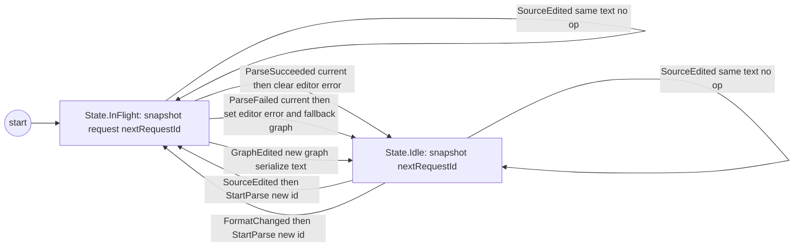
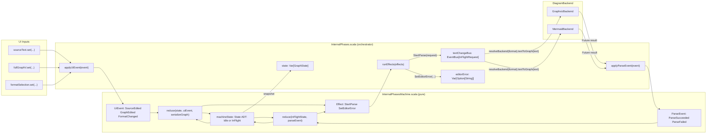

# InternalPhases State Machine

This is the canonical document for how the new reducer-based `InternalPhases` works.

## 1) Problem This Solves (Explicitly)

`InternalPhases` has to coordinate:

- immediate UI writes (`sourceText`, `fullGraphV`, format selection)
- asynchronous parsing (backend futures)
- parse responses that can arrive out of order

Without a strict transition model, this creates fragile behavior:

- stale parse responses overwriting newer user edits
- editor error state reflecting old parse failures
- transition logic spread across callbacks and setters
- hard-to-test race conditions

This reducer/state-machine design solves that by making transitions explicit and centralized:

- every state change goes through typed events + pure reducer logic
- parse effects are explicit (`StartParse`, `SetEditorError`)
- parse completion is accepted only when it matches the current in-flight request and current text/format
- impossible transition paths are reduced by type structure (`State.Idle` vs `State.InFlight`, `UiEvent` vs `ParseEvent`)

Practical outcome:

- deterministic behavior under async races
- easier focused testing of transitions/invariants
- clearer ownership of side effects

## 2) General Idea (High Level)

`InternalPhases` has one hard problem:

- user edits are immediate (`sourceText`, `fullGraphV`, format changes)
- parsing is async (backend futures)
- async results can arrive out of order

The state machine extraction makes that predictable:

1. turn input into a typed event (`UiEvent` or `ParseEvent`)
2. run one pure reducer function (`reduce(...)`)
3. get:
   - a new `State`
   - a list of `Effect`s to run (`StartParse`, `SetEditorError`)

`InternalPhases.scala` is orchestration.  
`InternalPhasesMachine.scala` is transition logic.

## 2) Visual Model

### 3.1 State Machine (States + Events)

### 3.2 Code Element Fit (Reducer + Orchestration)

## 4) Detailed Model

### 4.1 State

`State` in `InternalPhasesMachine` is a sealed ADT:

- `State.Idle(snapshot, nextRequestId)`
- `State.InFlight(snapshot, request, nextRequestId)`

### 4.2 Events

`UiEvent`:

- `SourceEdited(newText, selectedFormat)`
- `GraphEdited(newGraph)`
- `FormatChanged(newFormat)`

`ParseEvent`:

- `ParseSucceeded(request, graph, selectedFormat)`
- `ParseFailed(request, error, selectedFormat)`

### 4.3 Effects

- `StartParse(request)`
- `SetEditorError(error)`

The reducer emits effects; `InternalPhases.scala` executes them.

## 5) End-to-End Flows

### Flow A: User edits text

1. `sourceText` setter emits `SourceEdited(...)`.
2. Reducer updates snapshot text/format/origin.
3. Reducer emits `StartParse(requestId = N)`.
4. Orchestrator calls backend parse.
5. Backend completion is converted to `ParseSucceeded` or `ParseFailed`.
6. Parse reducer accepts only if request is still current.

Result: latest parse wins, stale parse is ignored.

### Flow B: User edits graph

1. `fullGraphV` setter emits `GraphEdited(newGraph)`.
2. Reducer serializes via `serializeGraph(...)`.
3. Snapshot text is updated synchronously.
4. In-flight parse is cleared.

### Flow C: User changes format

1. `formatSelection` change emits `FormatChanged(newFormat)`.
2. Reducer updates snapshot format.
3. Reducer emits `StartParse` for current text/new format.

## 6) Stale Parse Guard

`ParseSucceeded` / `ParseFailed` are applied only if all match:

1. `state.request.id == request.id`
2. `state.snapshot.text == request.text`
3. `selectedFormat == request.format`

Otherwise completion is ignored.

## 7) Where to Read the Code

- reducer: `viewer/src/main/scala/org/jpablo/graphexplorer/viewer/state/InternalPhasesMachine.scala`
- orchestrator: `viewer/src/main/scala/org/jpablo/graphexplorer/viewer/state/InternalPhases.scala`

Tests:

- reducer tests: `viewer/src/test/scala/org/jpablo/graphexplorer/viewer/state/InternalPhasesMachineSpec.scala`
- phase tests with fake backends: `viewer/src/test/scala/org/jpablo/graphexplorer/viewer/state/InternalPhasesPhaseSpec.scala`
- compatibility tests: `viewer/src/test/scala/org/jpablo/graphexplorer/viewer/state/InternalPhasesSpec.scala`

## 8) Tradeoff

Cost:

- extra event/effect plumbing
- one additional file (`InternalPhasesMachine.scala`)

Benefit:

- transitions in one place
- deterministic async behavior
- easier focused tests

## 9) Suggested Follow-Up Cleanup

1. Rename `snapshot` -> `graphState` in reducer `State`.
2. Add short scaladoc per `UiEvent` and `ParseEvent` case.
3. Add one inline comment in reducer where stale parse completion is intentionally ignored.
