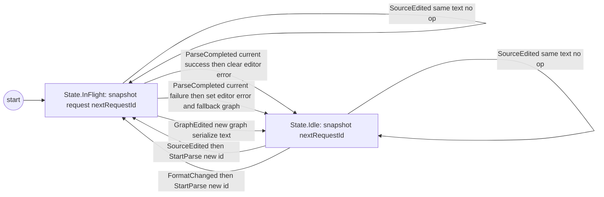
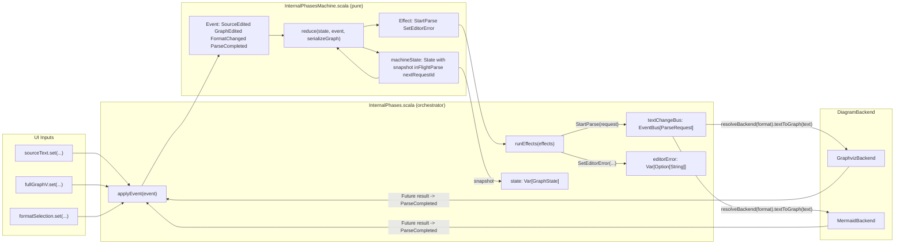

# InternalPhases State Machine

This is the canonical document for how the new reducer-based `InternalPhases` works.

## 1) General Idea (High Level)

`InternalPhases` has one hard problem:

- user edits are immediate (`sourceText`, `fullGraphV`, format changes)
- parsing is async (backend futures)
- async results can arrive out of order

The state machine extraction makes that predictable:

1. turn input into an `Event`
2. run one pure function: `reduce(state, event)`
3. get:
   - a new `State`
   - a list of `Effect`s to run (`StartParse`, `SetEditorError`)

`InternalPhases.scala` is orchestration.  
`InternalPhasesMachine.scala` is transition logic.

## 2) Visual Model

### 2.1 State Machine (States + Events)

### 2.2 Code Element Fit (Reducer + Orchestration)

## 3) Detailed Model

### 3.1 State

`State` in `InternalPhasesMachine` is a sealed ADT:

- `State.Idle(snapshot, nextRequestId)`
- `State.InFlight(snapshot, request, nextRequestId)`

### 3.2 Events

- `SourceEdited(newText, selectedFormat)`
- `GraphEdited(newGraph)`
- `FormatChanged(newFormat)`
- `ParseCompleted(request, result, selectedFormat)`

### 3.3 Effects

- `StartParse(request)`
- `SetEditorError(error)`

The reducer emits effects; `InternalPhases.scala` executes them.

## 4) End-to-End Flows

### Flow A: User edits text

1. `sourceText` setter emits `SourceEdited(...)`.
2. Reducer updates snapshot text/format/origin.
3. Reducer emits `StartParse(requestId = N)`.
4. Orchestrator calls backend parse.
5. Backend completion emits `ParseCompleted(...)`.
6. Reducer accepts only if request is still current.

Result: latest parse wins, stale parse is ignored.

### Flow B: User edits graph

1. `fullGraphV` setter emits `GraphEdited(newGraph)`.
2. Reducer serializes via `serializeGraph(...)`.
3. Snapshot text is updated synchronously.
4. In-flight parse is cleared.

### Flow C: User changes format

1. `formatSelection` change emits `FormatChanged(newFormat)`.
2. Reducer updates snapshot format.
3. Reducer emits `StartParse` for current text/new format.

## 5) Stale Parse Guard

`ParseCompleted` is applied only if all match:

1. `state.request.id == request.id`
2. `state.snapshot.text == request.text`
3. `selectedFormat == request.format`

Otherwise completion is ignored.

## 6) Where to Read the Code

- reducer: `viewer/src/main/scala/org/jpablo/graphexplorer/viewer/state/InternalPhasesMachine.scala`
- orchestrator: `viewer/src/main/scala/org/jpablo/graphexplorer/viewer/state/InternalPhases.scala`

Tests:

- reducer tests: `viewer/src/test/scala/org/jpablo/graphexplorer/viewer/state/InternalPhasesMachineSpec.scala`
- phase tests with fake backends: `viewer/src/test/scala/org/jpablo/graphexplorer/viewer/state/InternalPhasesPhaseSpec.scala`
- compatibility tests: `viewer/src/test/scala/org/jpablo/graphexplorer/viewer/state/InternalPhasesSpec.scala`

## 7) Tradeoff

Cost:

- extra event/effect plumbing
- one additional file (`InternalPhasesMachine.scala`)

Benefit:

- transitions in one place
- deterministic async behavior
- easier focused tests

## 8) Suggested Follow-Up Cleanup

1. Rename `snapshot` -> `graphState` in reducer `State`.
2. Add short scaladoc per `Event` case.
3. Add one inline comment in reducer where stale parse completion is intentionally ignored.
