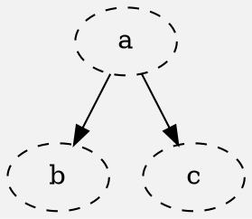

Example DOT




Reproduction:

1. Set "Fill Style" -> "Color Fill"

2. Set "(Border) Style" -> Solid
```dot
style="solid,filled",
```
3. Click on "reset Style"

Expectations:
1. Style set to graph default (dashed): ✅
2. Fill Style unchanged

Actual behavior:
2. Fill Style changed to "No Fill"  ❌
  Reason: onClick --> (_ => attrVar.set(None))
  this changes both FillStyle and Style
