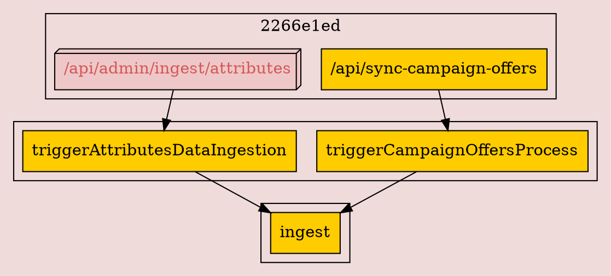
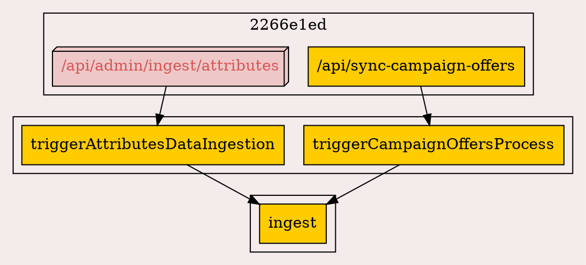

Problematic dot source
## Left

The 3d box appears to the left in graphviz, but to the right in https://dreampuf.github.io/GraphvizOnline
and https://edotor.net/.

## Right

The problem seems to happen in VizJS.
The same DOT source results in an SVG with clusters in different order.

