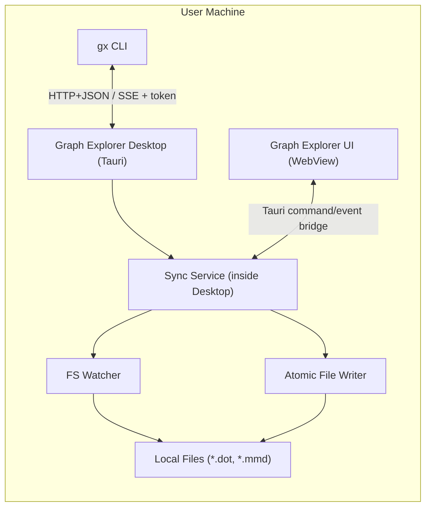

# Local Capabilities v1 Architecture

Status: Draft (2026-03-01)
Owners: Graph Explorer maintainers

## 1. Problem Statement

Graph Explorer is currently a web app. We want local file capabilities for workflows where:

- a user or coding agent writes diagram text on disk
- Graph Explorer renders updates automatically
- edits made in Graph Explorer are written back to disk

The design must keep a clear trust boundary and avoid exposing arbitrary local filesystem access to untrusted web origins.

## 2. Decision Summary

v1 adopts a hybrid model:

- keep the existing web app unchanged for zero-install usage
- add a desktop companion (`graph-explorer-desktop`, Tauri) for local capabilities
- add a small CLI (`gx`) as an automation/control interface to the desktop app

Rationale:

- local file access and file watching live in a native trusted runtime
- agent/script integration is provided by `gx` without turning the web app into a privileged runtime
- sync semantics are centralized in one place (desktop sync service)

## 3. Scope

### In Scope (v1)

- Open/watch local `.dot` and `.mmd` files in desktop app
- Real-time disk -> UI updates for watched files
- UI -> disk writes via explicit save action
- `gx` commands to open/watch/set/get/status against running desktop app
- Conflict detection using per-file revision numbers
- Localhost control channel secured by one-time token

### Out of Scope (v1)

- Hosted page (`graph-explorer.net`) direct access to local files
- Multi-user collaborative editing
- Binary diagram formats
- CRDT/OT patch merge
- Automatic background sync for files without explicit watch registration

## 4. High-Level Architecture



Trust boundaries:

- privileged boundary is the desktop app (Tauri runtime)
- browser web app remains unprivileged
- `gx` is a client to desktop, not the file authority

## 5. Components

### 5.1 graph-explorer-desktop (Tauri)

Responsibilities:

- enforce file access policy (allowlist + user-granted paths)
- own file watch registry and sync state
- expose local control API for `gx`
- emit events to UI and accept UI save commands

Runtime model:

- single process with:
  - embedded UI webview
  - sync service module
  - loopback control server (`127.0.0.1`, random port)

### 5.2 Sync Service (inside desktop)

Core state per watched file:

```text
WatchState {
  filePath: String
  format: Dot | Mermaid
  revision: Long              // monotonic in-memory version
  diskMtimeMs: Long
  diskHash: String            // sha256 of latest disk content
  uiDirty: Boolean
  lastSource: Disk | UI | CLI
}
```

Core responsibilities:

- debounce/coalesce filesystem events
- normalize file content events to `DocumentChanged`
- reject stale writes using `baseRevision`
- perform atomic writes and suppress self-write loops

### 5.3 gx CLI

Responsibilities:

- discover/connect to running desktop app
- trigger actions for scripts/agents
- read/write content via stdin/stdout and JSON responses

Non-responsibilities:

- no standalone filesystem watch/write authority in v1
- no bypass of desktop permission checks

### 5.4 Existing Web App

- remains deployment path for hosted and localhost usage
- no direct local file capabilities in browser context
- desktop mode reuses current UI and state logic via integration layer

## 6. Control Plane and Transport

### 6.1 Desktop Control Socket Discovery

On startup, desktop writes a runtime file:

`~/.graph-explorer/runtime/control.json`

Example:

```json
{
  "pid": 41245,
  "port": 42731,
  "token": "base64url-random-32b",
  "version": "1"
}
```

`gx` reads this file to connect. If missing, `gx` can launch desktop.

### 6.2 Loopback API

- host: `127.0.0.1`
- auth: `Authorization: Bearer <token>`
- protocol:
  - request/response: HTTP JSON
  - async events: SSE (`/events`)

Why HTTP+SSE:

- simple to debug and script
- works cross-platform
- one-way event stream is enough for v1

### 6.3 API Endpoints (v1)

- `POST /v1/watch`
  - body: `{ "path": "...", "openInUi": true }`
  - effect: register watcher; push initial content to UI
- `POST /v1/unwatch`
  - body: `{ "path": "..." }`
- `GET /v1/document?path=...`
  - response: content + revision + metadata
- `PUT /v1/document`
  - body: `{ "path": "...", "text": "...", "baseRevision": 12, "source": "cli" }`
  - effect: conditional write; reject stale base
- `GET /v1/status`
  - response: watched files, revision, dirty/conflict flags
- `GET /v1/events`
  - SSE topics:
    - `document.changed`
    - `document.conflict`
    - `watch.added`
    - `watch.removed`

## 7. Data Plane and Sync Semantics

### 7.1 Event Types

```text
DocumentChanged {
  path: String
  text: String
  revision: Long
  source: Disk | UI | CLI
  format: Dot | Mermaid
  timestampMs: Long
}

DocumentConflict {
  path: String
  attemptedBaseRevision: Long
  currentRevision: Long
}
```

### 7.2 Revision Rules

- revision starts at `1` when file enters watch registry
- each accepted write increments revision by exactly `1`
- all UI/CLI writes must include `baseRevision`
- stale write (`baseRevision != currentRevision`) returns `409 Conflict`

### 7.3 File Watch Rules

- debounce fs events by `75-150ms` (configurable)
- ignore events that match self-write fingerprint (`mtime + hash`)
- detect delete/rename and notify UI with `document.conflict` + actionable message

### 7.4 Write Rules

- writes are atomic:
  - write temp file in same directory
  - fsync temp
  - rename over target
- preserve line endings of current file when possible
- explicit save only in v1 (no autosave timer)

## 8. UX Flows (v1)

### 8.1 Agent/User Writes File on Disk -> Auto Render in UI

1. `gx watch /path/diagram.dot`
2. desktop registers watcher and emits initial `document.changed`
3. external process updates file
4. watcher emits disk change, sync service increments revision
5. UI receives new text and rerenders

### 8.2 UI Edit -> Persist to Disk

1. user edits diagram text in desktop UI
2. user hits save (`Cmd/Ctrl+S`)
3. UI sends `PUT /v1/document` equivalent through desktop bridge with `baseRevision`
4. on success, revision increments and disk write occurs atomically
5. watcher self-event is ignored via fingerprint

### 8.3 CLI/Agent Push -> UI + Disk

Example:

```bash
cat diagram.dot | gx set --file /abs/path/diagram.dot --stdin
```

Behavior:

- `gx` fetches current revision
- submits conditional write
- desktop writes file and emits `document.changed`
- active UI updates

## 9. Security Model

### 9.1 Defaults

- control server binds only to `127.0.0.1`
- random auth token required on every request
- token rotated each desktop launch
- no hosted origin is granted local file access in v1

### 9.2 File Access Policy

- access allowed only for files explicitly opened/watched by user or CLI
- optional workspace allowlist in settings:
  - deny outside allowlist unless user confirms
- block sensitive paths by default (configurable denylist)

### 9.3 Abuse/Hardening Controls

- request body size limit (for example 5 MB in v1)
- simple local rate limiting for control API
- structured audit log for watch/add/write/conflict events

## 10. CLI Contract (v1)

Commands:

- `gx open <path>`
- `gx watch <path> [--open]`
- `gx unwatch <path>`
- `gx get --file <path> [--json]`
- `gx set --file <path> --stdin`
- `gx status [--json]`

Exit codes:

- `0` success
- `2` desktop not reachable
- `3` auth failure
- `4` invalid path/permission denied
- `5` revision conflict
- `6` unknown internal error

## 11. Failure Handling

- desktop not running:
  - `gx` prints actionable message and optional `--launch` path
- file deleted while watched:
  - mark watch as degraded; retain in-memory copy for recovery prompt
- parse/render error:
  - keep latest text, show parser error, do not roll back file automatically
- crash recovery:
  - restore watch list from previous session metadata if files still exist

## 12. Milestones

### M1: Control Plane + One-Way Sync

- desktop runtime file + token auth
- `gx watch`, `gx status`
- disk -> UI live updates

Acceptance:

- editing watched file externally updates UI within 300ms median on local machine

### M2: Conditional Writes

- UI save + CLI set/get
- revision checks + conflict errors
- atomic write + self-event suppression

Acceptance:

- stale write always returns deterministic conflict response

### M3: Hardening

- allowlist/denylist policy
- audit logging
- crash/session recovery

Acceptance:

- privileged operations are denied outside policy with clear error messages

## 13. Testing Strategy

- unit:
  - revision/conflict state machine
  - watch event coalescing
  - self-write suppression
- integration:
  - desktop API + real temp files
  - CLI to desktop end-to-end flows
- e2e:
  - edit file via external process and assert UI refresh
  - edit in UI and assert disk content changed

## 14. Known Risks and Follow-Ups

- follow symlink behavior must be explicitly defined (path traversal risk)
- large-file performance constraints may require incremental diff later
- hosted-page pairing can be added later via outbound relay from desktop, not direct browser-to-filesystem

## 15. Open Questions

- Should v1 persist unsaved UI drafts separate from on-disk text?
- Do we enforce one active writer (UI or CLI) per watched file for simpler UX?
- What default workspace policy should ship first: permissive (prompt) or strict (allowlist required)?
