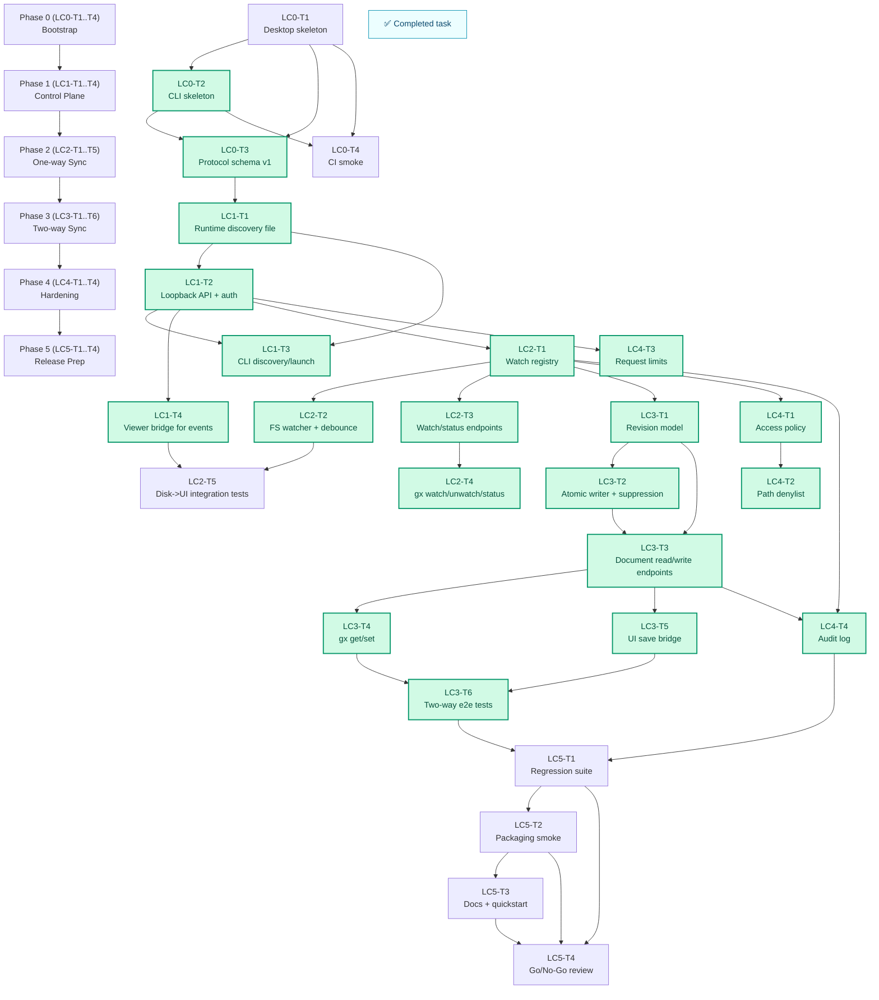

# Local Capabilities v1 Implementation Plan

Last updated: 2026-03-01
Related architecture:
- `docs/local-capabilities-v1-architecture.md`

## Goal

Ship a v1 local-capabilities stack for Graph Explorer with:

- desktop app (`graph-explorer-desktop`, Tauri) as privileged runtime
- `gx` CLI for automation/agent integration
- reliable two-way sync between UI text and local files with conflict protection

## Non-goals (v1)

- direct local filesystem access from hosted `graph-explorer.net`
- collaborative multi-user editing
- CRDT/OT merge semantics
- non-text diagram storage formats

## Status Legend

- `todo`: not started
- `in_progress`: currently active
- `blocked`: waiting on dependency or decision
- `✅`: acceptance criteria met with evidence

## Tracking Snapshot

Current phase: `Phase 5`
Current focus: `LC5-T2`
Resume from: `LC5-T2 - complete Linux/Windows packaging smoke to unblock go/no-go`

## Proposed Repository Layout

Target additions:

- `desktop/`
  - `src-tauri/` (Rust commands, sync service, FS watcher, control API)
  - `ui-shell/` (Tauri config + app shell)
- `gx/`
  - CLI binary and command parser
- `local-protocol/`
  - shared request/response/event schemas and version constants
- `docs/local-capabilities-v1-architecture.md` (already added)
- `docs/local-capabilities-v1-implementation-plan.md` (this file)

Notes:

- Keep current `viewer/` as source of UI.
- Desktop shell embeds the existing built viewer bundle in production.
- Dev mode can point desktop shell to Vite URL for faster iteration.

## Workstreams

- WS1: Desktop runtime and trust boundary
- WS2: Sync engine (watch/read/write/revision/conflict)
- WS3: Local control API and event stream
- WS4: `gx` CLI UX and automation surface
- WS5: Viewer integration in desktop mode
- WS6: Security and policy hardening
- WS7: Test automation and release readiness

## Task Board

| ID | Workstream | Task | Status | Dependencies | Acceptance Criteria | Evidence | Notes |
|---|---|---|---|---|---|---|---|
| LC0-T1 | WS1 | Bootstrap `desktop/` Tauri app and launch Graph Explorer UI | in_progress | none | Desktop opens and renders current viewer build | scaffold added + `cd desktop/src-tauri && cargo check` (green) | Need runtime launch verification against dev server |
| LC0-T2 | WS4 | Bootstrap `gx` binary with `status` command and structured output | ✅ | LC0-T1 | `gx status` can report "desktop not running" cleanly | `cd gx && cargo check` (green); `cargo run -- status --json` returns `DESKTOP_NOT_RUNNING` with exit code `2` | Exit code mapping started (`0`, `2`, `6`) |
| LC0-T3 | WS3 | Define protocol v1 schema (watch/document/status/events + errors) | ✅ | LC0-T1, LC0-T2 | Versioned schema checked in and consumed by desktop + CLI | Added `local-protocol/v1/schema.json` and `local-protocol/README.md` | Schema baseline is doc-first in this phase |
| LC0-T4 | WS7 | Add CI target for desktop+CLI compile smoke tests | in_progress | LC0-T1, LC0-T2 | CI fails on desktop/CLI compile errors | Added `.github/workflows/local-capabilities-smoke.yml` with `cargo check --locked` for desktop+gx | Await first CI execution on PR/push |
| LC1-T1 | WS3 | Implement runtime discovery file (`~/.graph-explorer/runtime/control.json`) | ✅ | LC0-T3 | Desktop writes pid/port/token/version on startup | Built and launched `target/debug/graph-explorer-desktop`; confirmed runtime file fields (`pid`, `port`, `token`, `version`) | File writes are atomic with owner-only permissions on unix |
| LC1-T2 | WS3 | Add loopback HTTP API skeleton with bearer-token auth | ✅ | LC1-T1 | Unauthorized requests rejected; valid token accepted | Started desktop binary, verified `GET /v1/status` returns `401` without token and `200` with bearer token | Server binds to `127.0.0.1:<runtime-port>` |
| LC1-T3 | WS4 | Implement CLI desktop discovery + optional launch flow | ✅ | LC1-T1, LC1-T2 | `gx status` connects without manual port flags | `gx status --json` discovers `~/.graph-explorer/runtime/control.json` and reports `running: true` while desktop is up | Optional auto-launch path deferred to later iteration |
| LC1-T4 | WS5 | Wire viewer desktop bridge for inbound `document.changed` events | ✅ | LC1-T2 | UI can receive and render pushed source text | Viewer listens to `ge:document.changed`/`document.changed` and routes payload text via `sourceTextWriter`; desktop `POST /v1/push-text` dispatches DOM custom event into webview | End-to-end visual verification still needed in interactive desktop run |
| LC2-T1 | WS2 | Implement watched-file registry and lifecycle (`watch`/`unwatch`) | ✅ | LC1-T2 | Register/unregister is persistent within session | Added in-memory watch registry with normalized path keys and watch descriptors (`path`, `format`, `revision`) | Session-persistent only (no restore yet) |
| LC2-T2 | WS2 | Implement filesystem watcher with debounce and coalescing | ✅ | LC2-T1 | External file change emits one normalized update | Polling watcher loop added (30ms poll, 75ms debounce/coalescing by content hash; tuned down from 100/120 for the LC2-T5 latency budget) with revision increment on emitted update | Uses per-watch background thread and stop channel |
| LC2-T3 | WS3 | Expose `POST /v1/watch`, `POST /v1/unwatch`, `GET /v1/status` | ✅ | LC2-T1 | Endpoints stable and documented by tests | Authenticated endpoint smoke verified with live desktop process; `/v1/status` now includes `watches` | Existing `/v1/status` retained and extended |
| LC2-T4 | WS4 | Implement `gx watch`, `gx unwatch`, `gx status --json` | ✅ | LC2-T3 | Commands work end-to-end against desktop | Live run: `gx watch/unwatch/status --json` updates and reflects registry in desktop API | `status` now uses authenticated HTTP `/v1/status` |
| LC2-T5 | WS7 | Integration tests for disk -> UI update path | ✅ | LC2-T2, LC1-T4 | File edit updates UI in <=300ms median locally | `scripts/local-capabilities-disk-to-ui-smoke.sh` (15 samples) measures external-edit -> revision-bump/webview-emit latency; local run min=150ms median=168ms p95=175ms max=180ms; wired into CI (macOS/Linux, blocking) | Required watcher tuning (poll 100->30ms, debounce 120->75ms) for CI margin; per-sample timings printed to test log |
| LC3-T1 | WS2 | Add in-memory per-file revision model and conflict checks | ✅ | LC2-T1 | Writes require matching `baseRevision` | `PUT /v1/document` enforces `baseRevision` equality and returns `409 DOCUMENT_CONFLICT` on stale writes | Revisions are monotonic `u64` per watch |
| LC3-T2 | WS2 | Implement atomic writer (temp+fsync+rename) + self-write suppression | ✅ | LC3-T1 | No watcher feedback loop on self writes | Atomic temp+rename writer added; self-write hash table suppresses watch-loop double processing | Uses content-hash suppression |
| LC3-T3 | WS3 | Expose `GET /v1/document` and `PUT /v1/document` | ✅ | LC3-T1, LC3-T2 | Stale writes return deterministic 409 error | Implemented endpoints with auth + error envelopes; stale write path validated via CLI smoke | Includes current/attempted revision in 409 payload |
| LC3-T4 | WS4 | Implement `gx get` and `gx set --stdin` | ✅ | LC3-T3 | CLI read/write honors revision contract | Added `gx get --file` and `gx set --file (--stdin|--text) [--base-revision]`; conflict exits with code `5` | `set` defaults base revision from `get` when omitted |
| LC3-T5 | WS5 | Add UI save path (`Cmd/Ctrl+S`) to desktop write bridge | ✅ | LC3-T3 | UI save writes file and increments revision | Added `CommandsShortcutSpec` asserting `Cmd/Ctrl+S` invokes desktop `saveCurrentText`; viewer bridge persists via `/v1/document` with revision context | End-to-end persistence verified in LC3-T6 smoke via `source=ui` writes |
| LC3-T6 | WS7 | End-to-end tests for UI -> disk and CLI -> disk/UI flows | ✅ | LC3-T4, LC3-T5 | All write paths verified with revision assertions | Added and executed `scripts/local-capabilities-phase3-smoke.sh` covering watch (`rev=1`), UI-sim write (`rev=2`), CLI write (`rev=3`), and stale-write conflict (`409`) | Browser-driven GUI automation remains optional hardening; revision contract covered |
| LC4-T1 | WS6 | Implement file access policy (explicit watch/open + optional allowlist) | ✅ | LC2-T1 | Writes denied outside policy with clear error | Added `GX_ALLOWED_ROOTS` / `GRAPH_EXPLORER_ALLOWED_ROOTS` policy in desktop watch path; `/v1/status` exposes configured roots | `scripts/local-capabilities-policy-smoke.sh` verifies allowed watch succeeds and out-of-scope watch returns API `400` with allowlist message |
| LC4-T2 | WS6 | Add denylist guards for sensitive/system paths | ✅ | LC4-T1 | Restricted targets blocked by default | Added default deny roots (`/private/etc`, `/private/var/db`, keychain/system binaries, `~/.ssh`, `~/.gnupg`, etc.) plus configurable `GX_DENY_ROOTS` / `GRAPH_EXPLORER_DENY_ROOTS` | Live run confirms `/etc/hosts` watch blocked with API message `path is blocked by denylist...`; policy smoke remains green |
| LC4-T3 | WS6 | Add request limits (payload size, local rate limiting) | ✅ | LC1-T2 | Oversized/abusive requests rejected safely | Added configurable limits (`GX_MAX_REQUEST_BODY_BYTES`, `GX_RATE_LIMIT_MAX_REQUESTS`, `GX_RATE_LIMIT_WINDOW_MS`) with `413 PAYLOAD_TOO_LARGE` and `429 RATE_LIMITED` responses | `scripts/local-capabilities-limits-smoke.sh` passed; phase3/policy smoke scripts remained green afterward |
| LC4-T4 | WS6 | Add structured local audit log (watch/add/write/conflict) | ✅ | LC2-T1, LC3-T3 | Log entries include timestamp, action, path, source | Added append-only JSONL audit log at `~/.graph-explorer/runtime/audit.log.jsonl` with events for `watch.added`, `watch.removed`, `watch.rejected`, `document.written`, `document.conflict`, and rate-limit rejections | Content bodies are not logged (metadata-only records) |
| LC5-T1 | WS7 | Regression pass: `sbt test`, desktop+CLI tests, `npm run build` | ✅ | LC3-T6, LC4-T4 | Full validation suite green | `sbt test` passed; smoke scripts `local-capabilities-phase3-smoke.sh`, `local-capabilities-policy-smoke.sh`, `local-capabilities-limits-smoke.sh` passed; `npm run build` passed | Build emitted known non-blocking chunk-size warnings |
| LC5-T2 | WS7 | Packaging smoke test for macOS/Linux/Windows desktop binaries | in_progress | LC5-T1 | Build artifacts run and connect to `gx` | Added release packaging matrix in `.github/workflows/local-capabilities-smoke.yml` for macOS/Linux/Windows (`cargo build --release --locked`) plus OS-specific runtime smoke steps (macOS/Linux via release smoke script, Windows via PowerShell flow) | Await first CI matrix execution to confirm Linux/Windows runtime smoke outcomes |
| LC5-T3 | WS7 | Docs/user guide updates (desktop install + CLI quickstart) | ✅ | LC5-T2 | Users can complete first watch/edit flow from docs | Added `docs/local-capabilities-v1-quickstart.md` with release-binary setup, first watch/edit flow, policy env options, audit log location, and troubleshooting | Includes conflict, auth, payload, and rate-limit troubleshooting paths |
| LC5-T4 | WS7 | v1 release checklist and go/no-go review | in_progress | LC5-T1, LC5-T2, LC5-T3 | Risks and residual gaps documented | Added `docs/local-capabilities-v1-go-no-go.md` with conditional no-go decision and explicit residual risk inventory | Final go/no-go blocked on LC5-T2 cross-platform packaging smoke |

## Phase Plan and Gates

| Phase | Focus | Tasks | Exit Criteria |
|---|---|---|---|
| Phase 0 | Bootstrap | LC0-T1..T4 | Desktop and CLI skeleton compile/run locally and in CI |
| Phase 1 | Control Plane | LC1-T1..T4 | Authenticated local API + desktop discovery operational |
| Phase 2 | One-way Sync | LC2-T1..T5 | Disk -> UI live updates are stable and measured |
| Phase 3 | Two-way Sync | LC3-T1..T6 | UI and CLI writes persist with revision-conflict safety |
| Phase 4 | Hardening | LC4-T1..T4 | Policy/logging/limits in place with tests |
| Phase 5 | Release Prep | LC5-T1..T4 | Validation, packaging smoke, docs, release decision complete |

## Dependency Diagram

## Suggested Timeline (6 weeks)

| Week | Target | Expected Output |
|---|---|---|
| W1 | Phase 0 + start Phase 1 | Running desktop shell, basic `gx`, protocol schema |
| W2 | Complete Phase 1 | Token-auth loopback API + viewer event bridge |
| W3 | Complete Phase 2 | Reliable disk watch pipeline + CLI watch commands |
| W4 | Complete Phase 3 | Revisioned writes from UI/CLI + conflict handling |
| W5 | Complete Phase 4 | Security policy, denylist, limits, audit logs |
| W6 | Complete Phase 5 | Full validation, packaging smoke, docs, release checklist |

## Test Matrix

| Invariant ID | Invariant | Coverage Target | Status |
|---|---|---|---|
| LC-INV-01 | Desktop API binds loopback only | integration test on bind address | todo |
| LC-INV-02 | Bearer token required for every control endpoint | integration auth tests | todo |
| LC-INV-03 | One fs change yields one normalized update after debounce | unit + integration watcher tests | todo |
| LC-INV-04 | Self-write does not trigger duplicate outbound update | writer/watcher integration tests | todo |
| LC-INV-05 | Stale writes always return conflict and never overwrite newer text | revision/conflict tests | todo |
| LC-INV-06 | UI save increments revision and persists atomically | end-to-end UI save tests | todo |
| LC-INV-07 | CLI set/get round-trips text and revision deterministically | CLI e2e tests | todo |
| LC-INV-08 | Policy denies out-of-scope paths with clear error codes | policy tests | todo |
| LC-INV-09 | Audit log emits entries for watch/write/conflict actions | logging integration tests | todo |
| LC-INV-10 | Existing web-only behavior remains unaffected | viewer regression tests | todo |

## Risk Register

| Risk | Impact | Mitigation | Owner |
|---|---|---|---|
| Watcher semantics differ by OS | missed or duplicate updates | normalize through coalescing + hash checks, test on each OS | WS2 |
| UI integration introduces feedback loops | repeated parse/render churn | strict source tagging and self-write suppression | WS2/WS5 |
| Desktop+CLI adds release complexity | delayed ship | keep v1 packaging minimal, no auto-update | WS7 |
| Overly broad file permissions | security regression | explicit watch/open policy + denylist + token auth | WS6 |

## Session Update Protocol

1. At session start:
   - set one task to `in_progress`
   - update `Current phase`, `Current focus`, and `Resume from`
2. At task completion:
   - set task to `✅`
   - add concrete evidence (tests, command, file)
3. If blocked:
   - set task to `blocked`
   - note blocker and unblock condition
4. At session end:
   - update `Last updated`
   - append one entry in Session Log

## Session Log

| Date | Summary | Tasks Touched | Verification | Next Resume Point |
|---|---|---|---|---|
| 2026-03-01 | Created initial detailed execution plan for local capabilities v1 | LC0-T1 planned | Planning only; no runtime code changes yet | LC0-T1 |
| 2026-03-01 | Added Phase 0 scaffolding for desktop runtime, `gx` CLI, and protocol v1 schema | LC0-T1 (in progress), LC0-T2 (✅), LC0-T3 (✅) | `cargo check` green for `desktop/src-tauri` and `gx`; `gx status --json` exercised | LC0-T1 |
| 2026-03-01 | Added CI smoke workflow for Rust local-capabilities crates | LC0-T4 (in progress) | New GitHub Actions workflow runs `cargo check --locked` for `desktop/src-tauri` and `gx` on macOS | LC0-T4 |
| 2026-03-01 | Implemented runtime discovery file emission on desktop startup and validated generated payload | LC1-T1 (✅) | `target/debug/graph-explorer-desktop` created `~/.graph-explorer/runtime/control.json`; `gx status --json` now reports `DESKTOP_UNREACHABLE` with discovered pid/port/version | LC1-T2 |
| 2026-03-01 | Implemented authenticated control API skeleton and validated CLI discovery against live desktop runtime | LC1-T2 (✅), LC1-T3 (✅) | `/v1/status` returns `401` unauthenticated and `200` with bearer token; `gx status --json` reports `running: true` when desktop process is live | LC1-T4 |
| 2026-03-01 | Wired desktop-to-viewer text bridge path and added authenticated text push endpoint for exercising inbound updates | LC1-T4 (✅) | `viewer/compile` green; authenticated `POST /v1/push-text` returns `200` and unauthenticated returns `401` while desktop runtime is live | LC2-T1 |
| 2026-03-01 | Implemented watch registry + watch/unwatch/status control endpoints and integrated `gx` watch lifecycle commands | LC2-T1 (✅), LC2-T3 (✅), LC2-T4 (✅) | Live desktop + CLI smoke: `gx watch` adds descriptor, `gx status --json` reports watches, `gx unwatch` removes descriptor; desktop API enforces token auth | LC2-T2 |
| 2026-03-01 | Added debounced file-change watcher loop and verified revision update on disk edit | LC2-T2 (✅) | Smoke run with temp DOT file: `gx watch` (`revision=1`) -> external file edit -> `gx status --json` shows `revision=2` | LC2-T5 |
| 2026-03-01 | Added document read/write API with revision conflicts and CLI get/set commands, including stale-write exit code behavior | LC3-T1 (✅), LC3-T2 (✅), LC3-T3 (✅), LC3-T4 (✅) | Live smoke: `gx get`, `gx set`, file content update, revision increments to `2`, stale write (`--base-revision 1`) returns conflict and exit code `5` | LC3-T5 |
| 2026-03-01 | Wired UI save bridge path (`Cmd/Ctrl+S`) to desktop document API context and preserved revision-safe backend flow | LC3-T5 (in progress) | `viewer/compile`, `cargo check` (desktop/gx) green; desktop+CLI smoke still green after bridge-context changes (`watch/get/set/status/unwatch`) | LC3-T5 |
| 2026-03-01 | Added phase-3 smoke automation script to assert revision-safe UI-sim and CLI write flows with stale-write conflict checks | LC3-T6 (in progress) | `scripts/local-capabilities-phase3-smoke.sh` passed locally: watch (`rev=1`) -> UI-sim write (`rev=2`) -> CLI set (`rev=3`) -> stale write (`409 DOCUMENT_CONFLICT`) | LC3-T6 |
| 2026-03-01 | Added automated save-shortcut verification and completed Phase 3 revision-flow smoke coverage | LC3-T5 (✅), LC3-T6 (✅) | `viewer/testOnly org.jpablo.graphexplorer.viewer.components.CommandsShortcutSpec` passed; `scripts/local-capabilities-phase3-smoke.sh` passed | LC4-T1 |
| 2026-03-01 | Implemented configurable allowlist + default denylist policy gates on watch registration and verified both success/failure paths | LC4-T1 (✅), LC4-T2 (✅) | `scripts/local-capabilities-policy-smoke.sh` passed (allowlist success + allowlist reject); live default denylist probe rejected `/etc/hosts`; `scripts/local-capabilities-phase3-smoke.sh` remained green | LC4-T3 |
| 2026-03-01 | Added request payload/rate limits with env-configurable thresholds and deterministic smoke coverage | LC4-T3 (✅) | `scripts/local-capabilities-limits-smoke.sh` passed (`413 PAYLOAD_TOO_LARGE`, `429 RATE_LIMITED`); `scripts/local-capabilities-phase3-smoke.sh`, `scripts/local-capabilities-policy-smoke.sh`, and `viewer/testOnly org.jpablo.graphexplorer.viewer.components.CommandsShortcutSpec` all passed after limits changes | LC4-T4 |
| 2026-03-01 | Added structured metadata-only audit logging for watch/write/conflict/rate-limit events and completed Phase 4 hardening scope | LC4-T4 (✅) | `~/.graph-explorer/runtime/audit.log.jsonl` contains timestamped JSONL records for watch lifecycle, writes, conflicts, and rate-limit rejections; no diagram text persisted | LC5-T1 |
| 2026-03-01 | Completed Phase 5 regression pass across Scala tests, local-capabilities smoke checks, and production frontend build | LC5-T1 (✅) | `sbt test` passed; `scripts/local-capabilities-phase3-smoke.sh`, `scripts/local-capabilities-policy-smoke.sh`, `scripts/local-capabilities-limits-smoke.sh` all passed; `npm run build` passed | LC5-T2 |
| 2026-03-01 | Ran macOS release packaging smoke with release binaries and end-to-end CLI/runtime connectivity checks | LC5-T2 (in progress) | `cargo build --release` for desktop/gx passed; release `gx` validated `status`, `watch`, `get`, `set`, stale-conflict (`exit=5`), and `unwatch` against release desktop runtime | LC5-T2 |
| 2026-03-01 | Added end-user local capabilities quickstart and troubleshooting guide | LC5-T3 (✅) | Created `docs/local-capabilities-v1-quickstart.md` covering build/install, first watch/edit flow, policy controls, audit logs, and common failure recovery | LC5-T4 |
| 2026-03-01 | Drafted go/no-go review with validated scope, explicit residual risks, and release recommendation | LC5-T4 (in progress) | Created `docs/local-capabilities-v1-go-no-go.md` with conditional no-go pending cross-platform packaging smoke completion | LC5-T2 |
| 2026-03-01 | Added cross-platform release packaging CI matrix and reusable release runtime smoke script | LC5-T2 (in progress) | Updated `.github/workflows/local-capabilities-smoke.yml` with macOS/Linux/Windows release build matrix + runtime smoke steps per OS; `scripts/local-capabilities-release-smoke.sh` passes locally | LC5-T2 |
