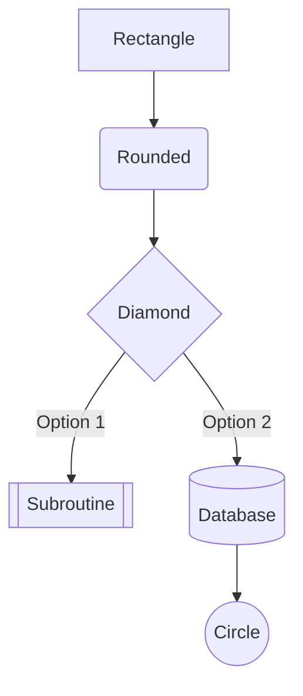
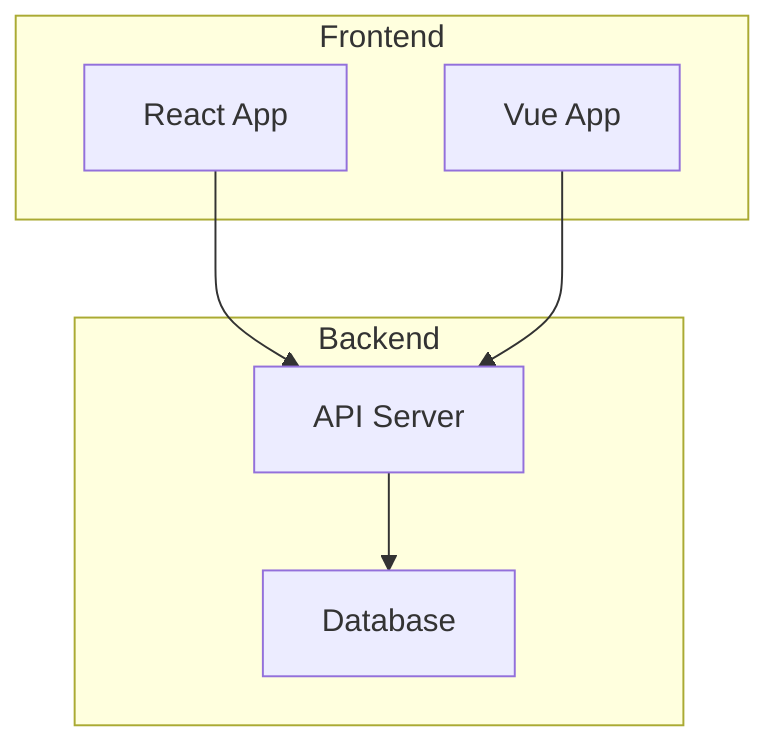
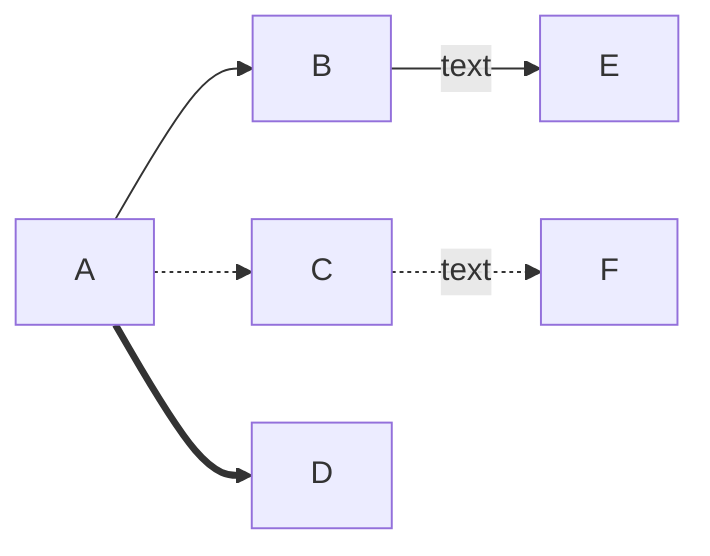
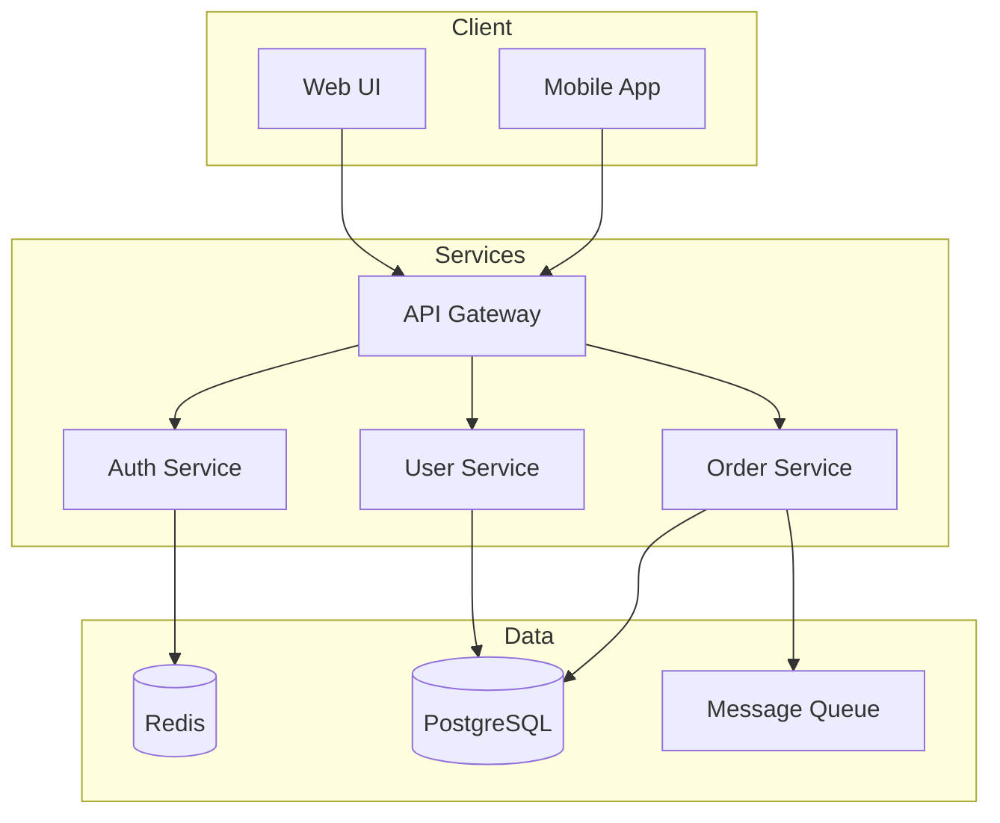

# Mermaid Diagram Support

Graph Explorer now supports [Mermaid](https://mermaid.js.org/) flowchart diagrams in addition to DOT/Graphviz diagrams.

## Quick Start

- Pick the diagram format from the dropdown beside "Documentation" (MermaidJS or Graphviz/DOT). The selection drives parsing—no auto-detection while you type.
- Paste or type your diagram source; the editor placeholder updates to match the chosen format.
- When loading a saved/shared diagram, the app preselects a format using simple heuristics (below). Switch manually if it guesses wrong.

## Initial Format Heuristics

We still infer an initial format on load using these patterns:

| Pattern | Format |
|---------|--------|
| `flowchart ...` | Mermaid |
| `graph TD`, `graph TB`, `graph BT`, `graph LR`, `graph RL` | Mermaid |
| `sequenceDiagram`, `classDiagram`, `stateDiagram` | Mermaid |
| `digraph ...`, `graph ...` (without direction) | DOT |
| `strict digraph ...`, `strict graph ...` | DOT |

## Supported Mermaid Features

### Flowcharts



### Subgraphs (Groups)



### Edge Styles



- `-->` Solid arrow
- `-.->` Dotted arrow
- `==>` Thick arrow
- `--text-->` Arrow with label

### Node Shapes

| Mermaid | Syntax | DOT Equivalent |
|---------|--------|----------------|
| Rectangle | `[text]` | box |
| Rounded | `(text)` | box (rounded) |
| Stadium | `([text])` | box |
| Diamond | `{text}` | diamond |
| Circle | `((text))` | circle |
| Database | `[(text)]` | cylinder |
| Hexagon | `{{text}}` | hexagon |
| Parallelogram | `[/text/]` | parallelogram |

## Architecture Overview

The Mermaid support is implemented through a modular backend architecture:

```
┌─────────────────┐     ┌──────────────────┐
│ DiagramFormat   │     │ DiagramBackend   │
│ (enum)          │     │ (trait)          │
│ - DOT           │     │ - textToGraph()  │
│ - Mermaid       │     │ - textToSvg()    │
└─────────────────┘     └──────────────────┘
                               ▲
                    ┌──────────┴──────────┐
                    │                     │
          ┌─────────┴────────┐  ┌────────┴─────────┐
          │ GraphvizBackend  │  │ MermaidBackend   │
          │ (synchronous)    │  │ (asynchronous)   │
          └──────────────────┘  └──────────────────┘
```

### Key Components

| File | Description |
|------|-------------|
| `DiagramFormat.scala` | Enum for supported formats with auto-detection logic |
| `DiagramBackend.scala` | Trait defining the backend interface |
| `MermaidBackend.scala` | Implementation using Mermaid.js library |
| `MermaidJS.scala` | Scala.js facade for Mermaid.js |
| `MermaidGraph.scala` | Data models for parsed Mermaid diagrams |
| `ToViewerGraph.scala` | Converts MermaidGraph to ViewerGraph |
| `SelectableElementStrategy.scala` | Handles SVG element selection per format |

### Data Flow

```
                    ┌──────────────────────────────────────────────────┐
                    │               InternalPhases                      │
                    │                                                   │
User Input ───────► │  sourceText ──► format detection                 │
(Mermaid text)      │       │                 │                        │
                    │       │         ┌───────┴───────┐                │
                    │       │         ▼               ▼                │
                    │       │     DOT (sync)    Mermaid (async)        │
                    │       │         │               │                │
                    │       │         ▼               ▼                │
                    │       └──► ViewerGraph ◄────────┘                │
                    │              │                                   │
                    └──────────────│───────────────────────────────────┘
                                   │
                                   ▼
                    ┌──────────────────────────────────────────────────┐
                    │               ViewerState                         │
                    │                                                   │
                    │  svgWithPositions ──► finalSVG ──► Canvas        │
                    │                                                   │
                    └──────────────────────────────────────────────────┘
```

### Async vs Sync Processing

- **DOT/Graphviz**: Synchronous parsing via WebAssembly (viz.js)
- **Mermaid**: Asynchronous parsing via JavaScript Promises

The `InternalPhases` class handles this difference by:
1. Parsing DOT synchronously in the signal setter
2. Triggering async parsing for Mermaid via an EventBus
3. Updating state when the async result arrives

## Limitations

Current Mermaid support has some limitations compared to DOT:

1. **Read-only**: Mermaid diagrams cannot be edited graphically (no drag-and-drop node creation or edge manipulation)
2. **No hidden elements**: The visibility toggle feature is not yet implemented for Mermaid
3. **Limited selection**: Edge selection may not work reliably due to Mermaid's SVG structure
4. **Flowcharts only**: Only flowchart/graph diagrams are fully supported (sequence diagrams, etc. will render but may not be interactive)

## Example: Software Architecture



## Adding Mermaid Examples to the Library

To add Mermaid examples to the examples section on the library page, add entries to `DotExamples.scala` with Mermaid syntax. The format will be auto-detected and rendered correctly.

## Dependencies

Mermaid support requires the `mermaid` npm package:

```bash
npm install mermaid
```

This is already included in the project's `package.json`.
