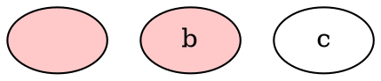

**Style Attribute Behavior**

This document explains how the DOT `style="..."` attribute works in Graph Explorer, how it maps to our internal model, and how global (default) and local (element) styles interact.

The rules below reflect the current implementation as of Sep 7, 2025.

**Overview**
- DOT `style` is a composite, comma‑separated attribute. Graphviz treats it as a single value, not merged across scopes.
- In Graph Explorer, we expand `style` into sub‑attributes in the internal model and only re‑combine it when exporting to DOT.
- Supported sub‑attributes:
  - Fill: `filled`
  - Bold: `bold`
  - Invisible: `invis`
  - Border style: `solid` (default), `dashed`, `dotted`, `bold`, `invis`, `tapered` (edges)
  - Corner style (nodes/groups): `normal` (default), `rounded`

Internal attribute names used in code:
- `FillStyle`, `BoldStyle`, `InvisibleStyle`, `BorderStyle`, `CornerStyle` (expanded sub‑attributes)
- `FillColor`, `Color` (colors)

**Model vs. DOT**
- Internal (ViewerGraphElements): stores expanded sub‑attributes; there is no `style` attribute on elements.
- DOT export: `combineStyleAttributes` merges the sub‑attributes (including defaults) back into a single `style` string per DOT’s expectations.

**Pipelines**
- DOT → Viewer (import)
  - `VizViewerGraphElements.expandStyleAttributes` parses `style` into sub‑attributes.
  - `removeIncorrectCombos` removes `fillcolor` if `filled` is not present. (Graphviz ignores `fillcolor` without `filled`; we normalize to avoid confusion.)
  - Result: no `style` attribute remains; only sub‑attributes exist.

- Viewer → DOT (export)
  - `ViewerGraphElements.combineStyleAttributes` merges sub‑attributes into `style` and simulates inheritance:
    - Local (element) sub‑attributes are merged with defaults to produce a single `style` value for each element.
    - Default attributes (e.g., `node [ ... ]`) also get a `style` if non‑empty.
  - Invariants/assertions:
    - An element must not have `fillcolor` present unless `FillStyle=true`. Violations assert during combine.

**Write‑Path Normalization (Core)**
- To keep the model coherent without pushing logic to export, we normalize at attribute update time:
  - When `fillcolor` is set to a concrete color (not `none`) → also set `FillStyle=true`.
  - When `fillcolor` is set to `none` → set `FillStyle=false`.
  - This normalization runs for both element updates and default (node/graph) updates.
  - Note: If only `FillStyle` is toggled without changing `fillcolor`, we do not re‑write `fillcolor`. The UI should co‑edit both when necessary to keep the invariant. If not, the combine step will assert if it encounters `fillcolor` with `FillStyle=false`.

**Global vs. Local Precedence**
- We simulate inheritance at export by merging defaults and locals:
  - Element explicit `FillStyle=false` overrides default `FillStyle=true`.
  - If element does not specify `FillStyle`, and default has `FillStyle=true`, element is considered filled.
  - For `BorderStyle` and `CornerStyle`, only non‑default values are included in the combined `style` string. Defaults (`solid`, `normal`) are omitted to keep DOT concise.

Key point about Graphviz behavior:
- Graphviz only paints a fill if `filled` appears in the element’s effective `style` list. A `fillcolor` alone (default or local) has no effect without `filled`.

**Reset Semantics**
- In DOT, `style=""` resets to normal defaults but does not merge — it replaces. Because we expand/merge sub‑attributes, we simulate inheritance explicitly: local + defaults → merged `style` at export.
- Practical reset in the app is performed by removing sub‑attributes on the element so that defaults apply (or by setting explicit false/normal/solid where appropriate).

**Examples**

1) Default fill only (user selects a fill color globally)

Internal defaults (after normalization):
- `defaultNodeAttributes`: `FillColor="#ffc9c9"`, `FillStyle=true`, plus other defaults (e.g., `shape`, `sides`).

Exported DOT:

```dot
digraph "G" {
  node [
    sides="5",
    shape="box",
    fillcolor="#ffc9c9",
    style="filled"
  ];
  "a" [ label="" ];
}
```

Node `a` inherits `filled` from the defaults and renders filled.

2) Default filled, element explicitly unfilled

Internal (element): `FillStyle=false` (UI should also set `fillcolor=none`).

Exported DOT (element must reset/replace default style):


Notes:
- Omitting a `style` on the element would still inherit the default `style="filled"`. To avoid fill, the element must provide a replacing style (e.g., `style=""` to reset, or `style="solid"`).
- If `c` mistakenly still carries a non‑`none` `fillcolor` with `FillStyle=false`, combine asserts to surface the inconsistency.

Equivalent initial DOT source for this scenario (if authored directly):

```dot
digraph "G" {
  node [ fillcolor="#ffc9c9", style="filled" ];
  "c" [ style="" ]; // or: "c" [ style="solid" ]
}
```


3) Defaults and locals combined

Internal (defaults): `CornerStyle=rounded`, `FillStyle=true`.
Internal (node): `BorderStyle=dashed`.

Exported DOT for the node:
```dot
"x" [ style="filled,rounded,dashed" ];
```
Order within `style` is deterministic from our combiner (`filled`, `bold`, `corner`, `border`).

**What Lives Where**
- Import (DOT→Viewer): parse and normalize (remove incorrect combos), expand to sub‑attributes.
- Core write paths: normalize fill invariants when attributes change (defaults and elements).
- Export (Viewer→DOT): merge defaults + locals, assert invalid states, and render `style` strings.

**UI Guidance**
- Minimal flow (recommended): the UI may send only `FillColor` updates; the core normalizes `FillStyle`.
  - Pick a color → set `FillColor="#rrggbb"` (or named). Core sets `FillStyle=true`.
  - Pick Transparent/None → set `FillColor="none"`. Core sets `FillStyle=false` and export emits `style=""` on that element to avoid inheriting default `filled`.
- If the UI exposes a separate “Filled” toggle:
  - Turning OFF must also set `FillColor="none"` to keep the invariant. If an element has `FillColor != none` with `FillStyle=false`, combine asserts.
  - Turning ON without choosing a color leaves `FillColor` unchanged (core does not synthesize a color). The element will be filled using its current `FillColor` if any, otherwise it inherits/defaults.
- Apply updates through the lenses so normalization runs:
  - Per element: `elementAttributesUpdates(...).update(...)` with `AttributeUpdates.of(FillColor -> "...")`.
  - Defaults: `defaultAttributesUpdates(AttributeTarget.node).update(...)`.
- For resets, prefer removing element sub‑attributes (or setting `style=""` in DOT) rather than relying on omission, since DOT merges are not implicit.

**References in Code**
- Expand/import: `VizViewerGraphElements.expandStyleAttributes`, `StyleSubAttributes.fromStyleString`, `StyleSubAttributes.removeIncorrectCombos`.
- Combine/export: `ViewerGraphElements.combineStyleAttributes`, `StyleSubAttributes.toStyleStrings`.
- Normalization at updates: `AttributesOps.normalizeFill` (applied from `updateAttributes` and `defaultAttributesUpdates`).
