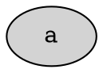

DOT style attribute is a composite attribute. It controls two things

1. Fill Style
2. Border style

Example:

style="solid,filled",

Fill Style is controlled by adding/removing "filled"
Border Style is controlled by setting solid | dashed |..., etc

## Interaction with global style

Example:

node specific style will override the global value.

## Reset functionality

"Reset" means to restore the default behavior.

There are three levels

1. DOT defaults in the abscense of a value
2. Global style set via node[...]
3. Element style set via a[...]

In most attributes, resetting the default for an element means deleting the value
from the element so that the global applies if present.

For composite attributes this doesn't work. We need to instead copy the global style
into the element.
